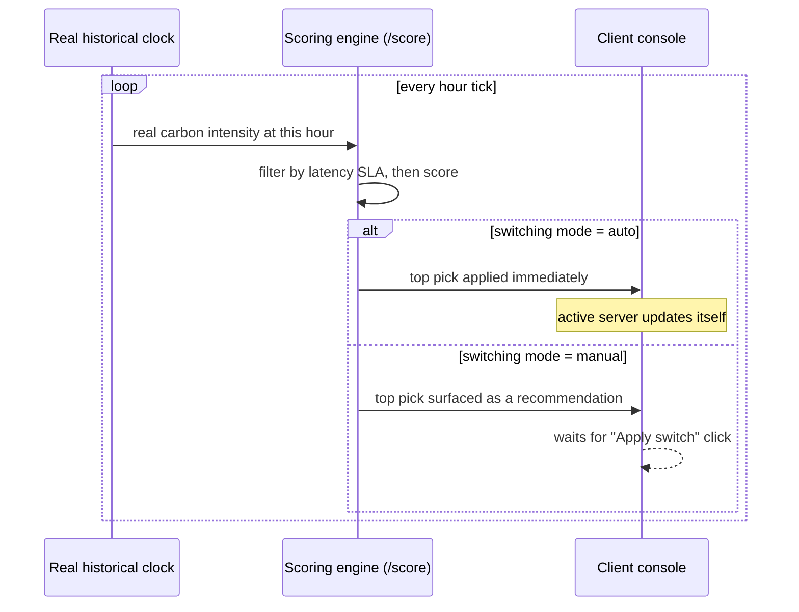
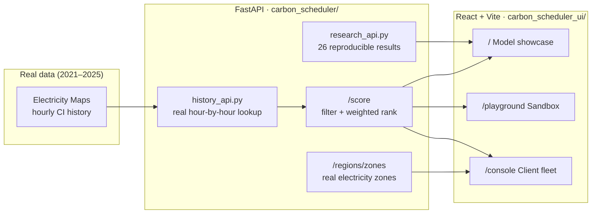

<div align="center">


<br/>

[](carbon_scheduler)
[](carbon_scheduler/api.py)
[](carbon_scheduler_ui)
[](carbon_scheduler_ui/vite.config.js)
[](#-the-data)

<br/>

**[Live showcase](#-what-this-actually-does)** · **[Quick start](#-quick-start)** · **[API](#-api-reference)** · **[Architecture](#-architecture)** · **[Research](#-research-methodology)**

</div>

<br/>

## What this actually does

Cloud workloads can run in more than one region. Electricity grids are dirtier at some hours than others, and dirtier in some places than others. This project scores every candidate region **every hour**, using real historical carbon-intensity data, and picks the cleanest one that still meets a latency budget — then shows its work.

Three things live on top of the same scoring engine, each answering a different question:

<table>
<tr>
<td width="33%" valign="top">

### 🌍 Model showcase
`/` — the research site

Scrub through **five real years** of grid data (2021–2025) hour by hour and watch the scheduler decide, live, with every rejected region and every score term shown.

</td>
<td width="33%" valign="top">

### 🎛️ Sandbox
`/playground` — tune it yourself

Drag the carbon / latency / resource weight sliders, change the latency SLA, and watch the ranking reshuffle in real time against the built-in region pool.

</td>
<td width="33%" valign="top">

### 🖥️ Client console
`/console` — bring your own fleet

Register **your own** servers against real electricity zones, choose **manual** (approve every switch) or **auto** (the system switches itself), and watch real carbon-aware failover happen to *your* fleet — the commercial pitch, made concrete.

</td>
</tr>
</table>

<br/>

<details>
<summary><b>▸ Click to expand: what "manual vs. auto" actually looks like</b></summary>

<br/>



Same clock, same scoring, same data either way — the only variable is whether a human has to press a button before it takes effect.

</details>

<br/>

## Architecture



<sub>One scoring endpoint, `POST /score`, backs all three pages — the showcase, the sandbox, and the console just supply different region lists.</sub>

<br/>

## Quick start

<details open>
<summary><b>1 · Backend (FastAPI, port 8001)</b></summary>

```bash
cd carbon_scheduler
pip install fastapi uvicorn pydantic python-dotenv requests statsmodels torch
cp ../.env.example ../.env             # then fill in ELECTRICITY_MAPS_TOKEN
python -m uvicorn api:app --host 127.0.0.1 --port 8001 --reload
```

</details>

<details open>
<summary><b>2 · Frontend (React + Vite, port 5173)</b></summary>

```bash
cd carbon_scheduler_ui
npm install
npm run dev
```

</details>

Open **`http://localhost:5173`** — the frontend proxies `/api/*` straight to the backend on `:8001`, so both need to be running.

> Get a free Electricity Maps token at [electricitymaps.com](https://www.electricitymaps.com/) — the scoring engine and the historical replay both run on real values from that API, nothing here is randomly generated.

<br/>

## API reference

<div align="center">

| Method | Endpoint | What it returns |
|:------:|----------|------------------|
| `GET`  | `/regions/` | Current region pool with live/simulated carbon + latency |
| `GET`  | `/regions/zones` | Real electricity zones only (name/lat/lng) — powers the console's zone picker |
| `GET`  | `/regions/history/range` | Start/end bounds of the real 2021–2025 dataset |
| `GET`  | `/regions/history/at?timestamp=` | Real per-region carbon intensity at one real historical hour |
| `POST` | `/score` | Filters by latency SLA, scores by weighted carbon/latency/resources, returns a ranked, explainable decision |
| `POST` | `/forecast` | LSTM (per-zone, falls back to ARIMA) carbon forecast + best delay window |
| `POST` | `/carbon/estimate` | Operational + embodied (Scope 3) lifecycle CO₂ estimate |
| `POST` | `/scaling/elastic` | CarbonScaler-style elastic vCore recommendation |
| `POST` | `/schedule/joint` | Joint spatial + temporal shift for delay-tolerant workloads |
| `GET`  | `/research/manifest` | Index of every reproducible research result exposed on the site |

</div>

<details>
<summary><b>▸ Example: score a client's own fleet (what <code>/console</code> sends)</b></summary>

```bash
curl -X POST http://localhost:8001/score \
  -H "Content-Type: application/json" \
  -d '{
    "regions": [
      {"name": "prod-api-1", "carbon": 427.7, "latency": 42, "resources": 80, "lat": 38.13, "lng": -78.45},
      {"name": "prod-api-2", "carbon": 575.6, "latency": 65, "resources": 80, "lat": 19.07, "lng": 72.87}
    ],
    "weights": {"carbon": 0.4, "latency": 0.3, "resources": 0.3},
    "max_latency": 200
  }'
```

The response includes the ranked list, rejected regions with reasons, the final pick, and a plain-language explanation — the same shape whether the caller is the showcase, the sandbox, or the console.

</details>

<br/>

## The data

No synthetic numbers back the headline claims on this site.

- **Carbon intensity** — real hourly history (2021–2025) per electricity zone, sourced from Electricity Maps.
- **Latency** — measured from real vantage points against real cloud endpoints (`carbon_scheduler/aws/measure_cloud_latency.py`).
- **Forecasting** — a trained per-zone LSTM (`services/lstm_forecaster.py`) with an ARIMA(2,1,2) fallback, evaluated against held-out real data.
- **Every research result** on the homepage traces back to a script in `carbon_scheduler/scripts/` that anyone can re-run.

<br/>

## Repo layout

```text
carbon_scheduler/            FastAPI backend
├── api.py                     scoring, forecasting, carbon-estimate endpoints
├── history_api.py             real historical hour-by-hour lookup
├── research_api.py            reproducible research result manifest
├── models/                    Region, Workload dataclasses + trained LSTMs
├── services/                  scheduler, forecaster, electricity + simulator services
├── scripts/                   every result on the site, as a re-runnable script
└── data/                      real CI history, latency measurements, result JSON

carbon_scheduler_ui/          React + Vite frontend
├── src/pages/                 HomePage, PlaygroundPage, ConsolePage
├── src/sections/              narrative site sections + console/ subcomponents
├── src/hooks/                 useHistoricalReplay, useConsoleClock, useClientFleet…
└── src/components/            demo/, layout/, research/ building blocks
```

<br/>

## Research methodology

<details>
<summary><b>▸ Click to expand: how "carbon saved" is actually measured</b></summary>

<br/>

A carbon-aware scheduler can save carbon two different ways:

1. **Structural** — knowing in advance which regions have permanently cleaner electricity (a one-time decision).
2. **Adaptive** — reacting every hour to which region is cleanest *right now* (an always-on decision).

`carbon_scheduler/scripts/held_out_generalization_test.py` separates these with a genuine held-out split (the static baseline never sees the years it's judged on), then `significance_test_adaptivity.py` tests whether the adaptive gain is statistically real. Both are re-run live to produce every number shown under **Decomposition** on the homepage — nothing is pasted in.

</details>

<br/>

<div align="center">


<sub>Built for a commercial-pitch demo — real scoring engine, your own fleet, your call on manual vs. automatic.</sub>
</div>
