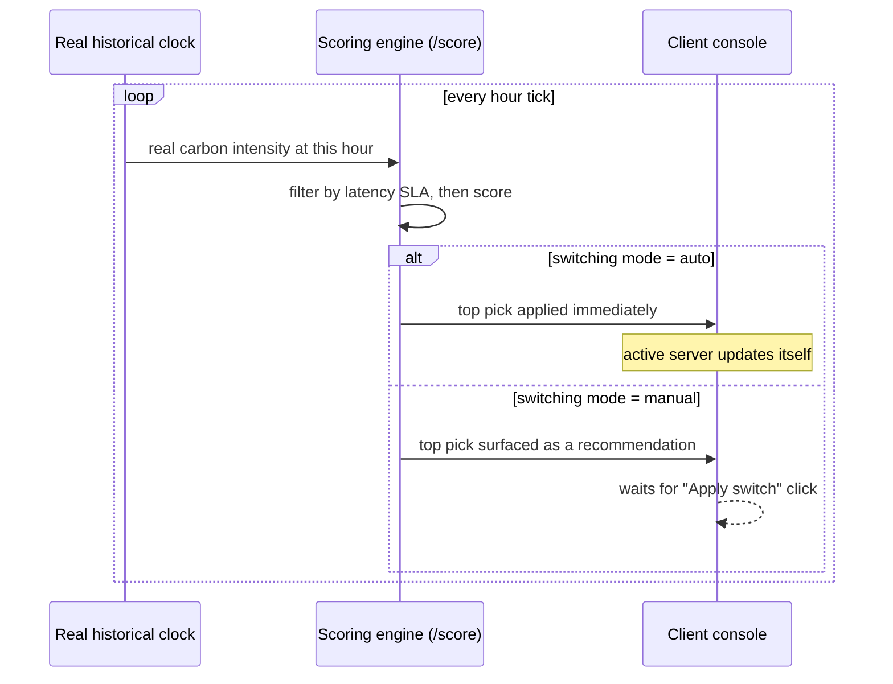
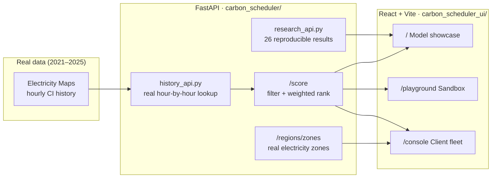

<div align="center">


<br/>

[](carbon_scheduler)
[](carbon_scheduler/api.py)
[](carbon_scheduler_ui)
[](carbon_scheduler_ui/vite.config.js)
[](#-the-data)

<br/>

**[Live showcase](#-what-this-actually-does)** · **[Quick start](#-quick-start)** · **[API](#-api-reference)** · **[Architecture](#-architecture)** · **[Research](#-research-methodology)**

</div>

<br/>

## What this actually does

Cloud workloads can run in more than one region. Electricity grids are dirtier at some hours than others, and dirtier in some places than others. This project scores every candidate region **every hour**, using real historical carbon-intensity data, and picks the cleanest one that still meets a latency budget — then shows its work.

Three things live on top of the same scoring engine, each answering a different question:

<table>
<tr>
<td width="33%" valign="top">

### 📋 Placement Audit
`/` — the product

Triage a fleet workload by workload: **move**, **shift in time**, **stay**, **blocked by cost**, **never move**, or **fix compliance first** — each with the rule that decided it, tonnes of CO₂, and what the change costs.

</td>
<td width="33%" valign="top">

### 🔭 Forecasting
`/forecasting` — models on trial

ARIMA and CarbonLSTM forecasts at 1/3/6/12 h, each model's cleanest hour, and the **no-regret guard's** verdict on whether that delay was allowed — plus every model's verified track record.

</td>
<td width="33%" valign="top">

### 📡 Pilot telemetry
`/pilot` — what actually ran

Decisions, chosen offsets and AWS dispatch outcomes from three independent scheduling pipelines running hourly on live EC2 across 13 regions.

</td>
</tr>
</table>

Also: `/console` (score one workload across the fleet), `/playground` (tune weights, add and remove servers, watch it switch or refuse), `/report` (printable audit), `/about` (what the project does and does not claim).

<br/>

<details>
<summary><b>▸ Click to expand: what "manual vs. auto" actually looks like</b></summary>

<br/>



Same clock, same scoring, same data either way — the only variable is whether a human has to press a button before it takes effect.

</details>

<br/>

## The live pilot

Three scheduling policies run side by side, hourly, from a small orchestrator instance in `us-east-1`, dispatching real jobs to EC2 instances across the region fleet through AWS Systems Manager:

| Pipeline | Policy |
|---|---|
| `aws-adaptive` | Reactive — scores current intensity, never delays |
| `aws-lstm` | CarbonLSTM forecasts 12 h ahead, delays only when the guard allows |
| `aws-arima` | ARIMA(2,1,2) forecasts, same guard |

Every forecast is recorded and then scored against the intensity actually measured when its target hour arrives. That record — 25,000+ verified forecasts — decides whether a model is allowed to delay work at all:

- **error is not enough.** ARIMA had the lower 1-hour error and still delivered **−3.8%** against a promised +12.7%, so the guard disabled it.
- the same rule later withdrew **CarbonLSTM's 1-hour horizon** when it slipped to −0.5% delivered with 49.5% regret.
- thresholds live in `data/forecast_calibration.json`. `scripts/reverify_and_calibrate.py` recommends; a human edits the `applied` block. Nothing re-enables a forecaster automatically.

Scheduling itself is a `cron.d` entry on the orchestrator, and a daily teardown check terminates the whole fleet on a fixed date, so the pilot cannot outlive its budget.

<br/>

## Architecture



<sub>One scoring endpoint, `POST /score`, backs all three pages — the showcase, the sandbox, and the console just supply different region lists.</sub>

<br/>

## Quick start

<details open>
<summary><b>1 · Backend (FastAPI, port 8001)</b></summary>

```bash
cd carbon_scheduler
pip install fastapi uvicorn pydantic python-dotenv requests statsmodels torch
cp ../.env.example ../.env             # then fill in ELECTRICITY_MAPS_TOKEN
python -m uvicorn api:app --host 127.0.0.1 --port 8001 --reload
```

</details>

<details open>
<summary><b>2 · Frontend (React + Vite, port 5173)</b></summary>

```bash
cd carbon_scheduler_ui
npm install
npm run dev
```

</details>

Open **`http://localhost:5173`** — the frontend proxies `/api/*` straight to the backend on `:8001`, so both need to be running.

<details>
<summary><b>3 · Optional: historical replay and forecasting</b></summary>

The licensed history and the trained weights are not in this repo. With your own
Electricity Maps token:

```bash
cd carbon_scheduler
python scripts/download_ci_history.py     # or import_yearly_csv.py for CSV exports
python scripts/train_lstm.py              # writes models/lstm_{zone}.pt
python scripts/export_public_evidence.py  # derived-only evidence -> data/public/
```

</details>

> Get an Electricity Maps token at [electricitymaps.com](https://www.electricitymaps.com/); academic access is free on an institutional address. The scoring engine and the replay run on real measured values — nothing here is randomly generated.

<br/>

## API reference

<div align="center">

| Method | Endpoint | What it returns |
|:------:|----------|------------------|
| `GET`  | `/regions/` | Current region pool with live/simulated carbon + latency |
| `GET`  | `/regions/zones` | Real electricity zones only (name/lat/lng) — powers the console's zone picker |
| `GET`  | `/regions/history/range` | Bounds of the licensed 2021–2025 dataset — returns **403** unless `CADSS_SERVE_LICENSED_HISTORY=1` |
| `GET`  | `/regions/history/at?timestamp=` | Per-region intensity at one historical hour — same 403 gate |
| `POST` | `/score` | Filters by latency SLA, scores by weighted carbon/latency/resources, returns a ranked, explainable decision |
| `POST` | `/forecast` | LSTM (per-zone, falls back to ARIMA) carbon forecast + best delay window |
| `POST` | `/carbon/estimate` | Operational + embodied (Scope 3) lifecycle CO₂ estimate |
| `POST` | `/scaling/elastic` | CarbonScaler-style elastic vCore recommendation |
| `POST` | `/schedule/joint` | Joint spatial + temporal shift for delay-tolerant workloads |
| `GET`  | `/pilot/telemetry` | Live pilot decisions and dispatch outcomes (instance identifiers stripped) |
| `GET`  | `/forecasting/multi-stage` | ARIMA + CarbonLSTM forecasts at 1/3/6/12 h with the guard's decision per stage |
| `GET`  | `/forecasting/verification` | Verified accuracy, direction and regret per model and horizon |
| `GET`  | `/research/manifest` | Index of every reproducible research result exposed on the site |

</div>

<details>
<summary><b>▸ Example: score a client's own fleet (what <code>/console</code> sends)</b></summary>

```bash
curl -X POST http://localhost:8001/score \
  -H "Content-Type: application/json" \
  -d '{
    "regions": [
      {"name": "prod-api-1", "carbon": 427.7, "latency": 42, "resources": 80, "lat": 38.13, "lng": -78.45},
      {"name": "prod-api-2", "carbon": 575.6, "latency": 65, "resources": 80, "lat": 19.07, "lng": 72.87}
    ],
    "weights": {"carbon": 0.4, "latency": 0.3, "resources": 0.3},
    "max_latency": 200
  }'
```

The response includes the ranked list, rejected regions with reasons, the final pick, and a plain-language explanation — the same shape whether the caller is the showcase, the sandbox, or the console.

</details>

<br/>

## The data

No synthetic numbers back the headline claims on this site.

- **Carbon intensity** — real hourly history (2021–2025) per electricity zone, sourced from Electricity Maps under academic access. Not redistributed here (see [licensing](#data-source-and-licensing)).
- **Latency** — measured from real vantage points against real cloud endpoints (`carbon_scheduler/aws/measure_cloud_latency.py`).
- **Forecasting** — a trained per-zone LSTM (`services/lstm_forecaster.py`) with an ARIMA(2,1,2) fallback, evaluated against held-out real data.
- **Live verification** — every forecast the pilot made, scored against the intensity measured at its target hour.
- **Every research result** traces back to a script in `carbon_scheduler/scripts/` that anyone can re-run.

<br/>

## Repo layout

```text
carbon_scheduler/            FastAPI backend
├── api.py                     scoring, forecasting, multi-stage + verification endpoints
├── history_api.py             licensed history lookup (gated off by default)
├── research_api.py            reproducible research result manifest
├── models/                    Region, Workload dataclasses (trained .pt weights are gitignored)
├── services/                  scheduler, forecasters, failsafe engine + no-regret guard,
│                              forecast tracker, calibration instrument
├── aws/                       orchestrator deploy, the three pilot runners, SSM dispatch,
│                              latency measurement, teardown
├── scripts/                   every result in the report, as a re-runnable script
└── data/                      result JSON; public/ holds the derived evidence that is safe
                               to publish (licensed history and raw logs stay local)

carbon_scheduler_ui/          React + Vite frontend
├── src/pages/                 Audit, AuditReport, Console, Forecasting, Pilot, Playground, About
├── src/sim/                   in-browser port of the scheduler + audit model, with parity
│                              tests against the Python engine
├── src/hooks/                 useLiveScheduler, useClientFleet, useHistoricalReplay…
└── src/components/            demo/, layout/, research/ building blocks
```

<br/>

## Research methodology

<details>
<summary><b>▸ Click to expand: how "carbon saved" is actually measured</b></summary>

<br/>

A carbon-aware scheduler can save carbon two different ways:

1. **Structural** — knowing in advance which regions have permanently cleaner electricity (a one-time decision).
2. **Adaptive** — reacting every hour to which region is cleanest *right now* (an always-on decision).

A third question sits on top: whether a **forecast** should be acted on at all. `scripts/reverify_and_calibrate.py` answers it from verified outcomes rather than from error metrics.

`carbon_scheduler/scripts/held_out_generalization_test.py` separates the first two with a genuine held-out split (the static baseline never sees the years it's judged on), then `significance_test_adaptivity.py` tests whether the adaptive gain is statistically real. Both are re-run live to produce every number shown under **Decomposition** on the homepage — nothing is pasted in.

</details>

<br/>

## Data source and licensing

Carbon-intensity data comes from **Electricity Maps** (<https://www.electricitymaps.com>),
used under academic access granted for this undergraduate research project.

Their Terms of Service permit academic use but not redistribution of the data
itself. This repository therefore contains **no measured carbon-intensity
values**:

- the licensed 2021–2025 hourly history (`carbon_scheduler/data/history/`,
  `data/raw_yearly/`) is not published — regenerate it with your own token via
  `scripts/download_ci_history.py` or `scripts/import_yearly_csv.py`;
- the raw pilot logs and forecast-verification records are not published either,
  because each record carries measured intensity at a timestamp;
- what is published, under `carbon_scheduler/data/public/`, is the derived
  subset every result in the report is computed from: forecast error, direction
  correctness, regret, percentage savings, region decisions, offsets, guard
  status and dispatch outcomes. Generate it with
  `python scripts/export_public_evidence.py`.

If you cite or build on this work, attribute the underlying data to
Electricity Maps.

<br/>

<div align="center">


<sub>Undergraduate research project · Sahyadri College of Engineering and Management · data by <a href="https://www.electricitymaps.com">Electricity Maps</a></sub>
</div>
